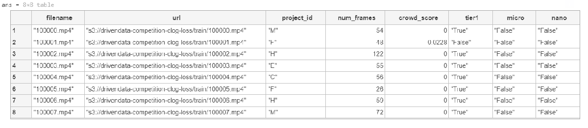
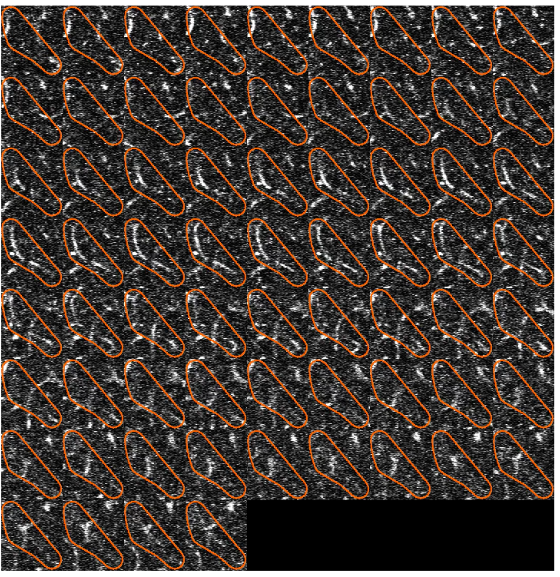
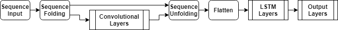
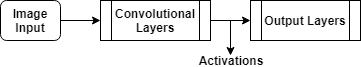
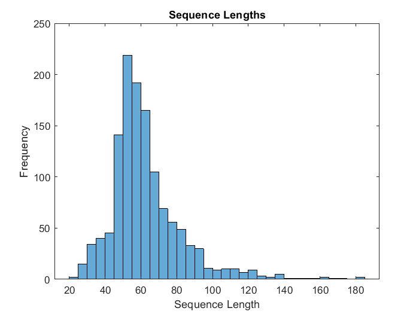
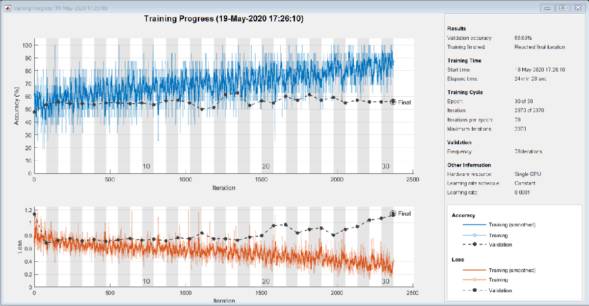
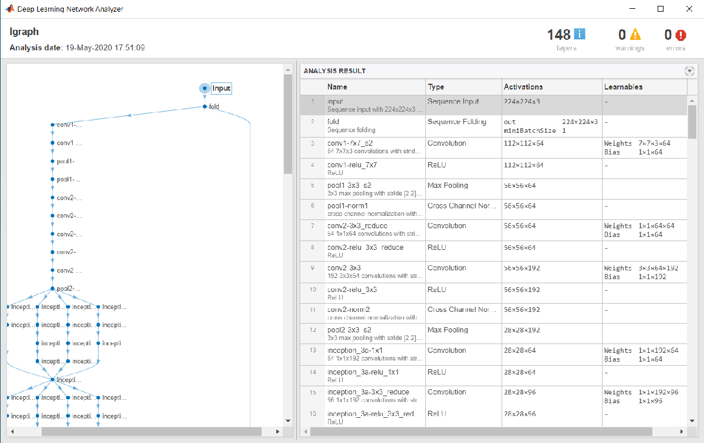
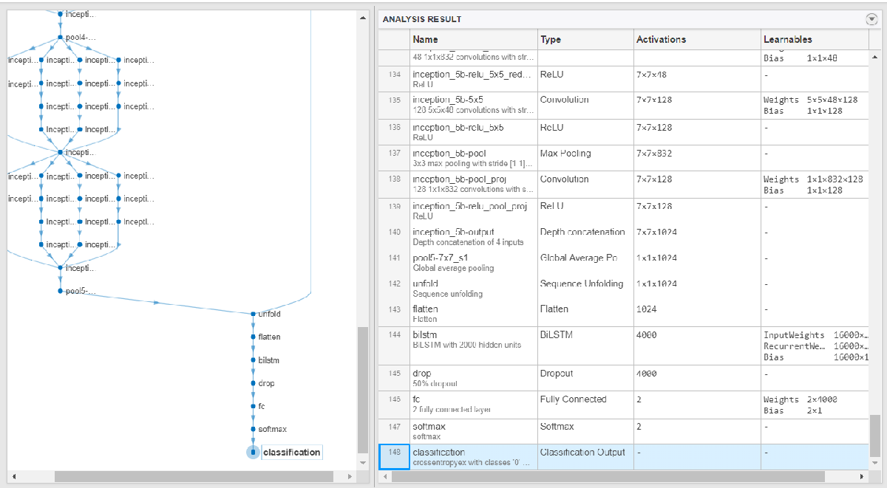

# Clog Loss: Advance Alzheimer’s Research with Stall Catchers
# Getting Started with MATLAB


Hello all! We at MathWorks, in collaboration with DrivenData, are excited to bring you this challenge. Through this challenge, you could help in finding an Alzheimer’s treatment target in reach within the next year or two. You would also get the real-world experience of working with a dataset of live videos from mouse brain. We also encourage you to use MATLAB to train your model by providing [complimentary MATLAB licenses.](https://www.mathworks.com/academia/student-competitions/advance-alzheimers-research.html) 


The objective of this challenge is to classify the outlined blood vessel segment as 


   -  'flowing' - if blood is moving through the vessel or 
   -  'stalled' if the vessel has no blood flow.  


The main asset for solving this challenge are the videos themselves! Each video is identified by its `filename`, which is a numeric string followed by .mp4, e.g., `100000.mp4`. **All videos are hosted in a public s3 bucket.**


The full training dataset contains over 580,000 videos, which is around 1.5 terabytes! To help facilitate faster model prototyping, there are two subset versions of the dataset, referred to as n*ano *and *micro.*


In addition to the videos, you are provided with "`train_metadata.csv`" and "`test_metadata.csv`" files. These files consist of the information like filename, URL of each file, number of frames of each video, *nano* and *micro* subsets indication. "train_labels.csv" is the file of labels of training data. You can download these files from competition's [Data Download](https://www.drivendata.org/competitions/65/clog-loss-alzheimers-research/data/) page. 


For further details about the dataset check out the [Problem Description](https://www.drivendata.org/competitions/65/clog-loss-alzheimers-research/page/217/) on the competition webpage. 


We are providing a basic Benchmark starter code in MATLAB on the *Nano*subset version of the dataset. In this code, we walk through a basic classification model, where we are combining a pre-trained image classification model and an LSTM network. Then, we will use this model to predict the type of the vessel on test data and save a CSV file in the format required for the challenge.


This can serve as basic code where you can start analyzing the data and work towards developing a more efficient, optimized, and accurate model using more of the training data available. Additionally, we have provided a few tips and tricks to work on the complete 1.5TB dataset. On the challenge's [Problem Description](https://www.drivendata.org/competitions/65/clog-loss-alzheimers-research/page/217/) page, all required details for videos, labels performance and submission metrics are provided.


So, let's get started with this dataset!


# Load Training Data


To access the variable values from the file `train_metadata.csv,`load the file in the form of a [tabulartext datastore](https://www.mathworks.com/help/releases/R2020a/matlab/ref/matlab.io.datastore.tabulartextdatastore.html) in the workspace. 


```matlab:Code
ttds = tabularTextDatastore("train_metadata.csv","ReadSize",'file',"TextType","string");
train =read(ttds);
```


We can then preview the datastore. This visualizes the first 8 rows of the file. 


```matlab:Code
preview(ttds)
```





You can also import csv files in MATLAB using` `[readtable](https://www.mathworks.com/help/releases/R2020a/matlab/ref/readtable.html) function. Here, we create training labels from the `train_labels.csv` file and store it in a form of table. We then convert the values of the variable `stalled` to categorical, as most deep leaning functions used accept categorical values. 


```matlab:Code
trainlabels = readtable("train_labels.csv");
trainlabels.stalled = categorical(trainlabels.stalled);
```


In this starter code, we will be using the `nano` subset of the database. Here, we retrieve the files and labels for `nano` subset from the tables created above and save it in variables `nanotrain `and `nanotrainlabels`. (To work with the complete dataset, you will not need this step)


```matlab:Code
nanotrain = train(train.nano == 'True',:);
nanotrainlabels = trainlabels(train.nano == 'True',:);
```

# Acces \& Process Video Files


Datastores in MATLAB® are a convenient way of working with and representing collections of data that are too large to fit in memory at one time. It is an object for reading a single file or a collection of files or data. The datastore acts as a repository for data that has the same structure and formatting. To learn more about different datastores, check out the documents below:


   1.  [Getting Started with Datastore](https://www.mathworks.com/help/matlab/import_export/what-is-a-datastore.html) 
   1.  [Select Datastore for File Format or Application](https://www.mathworks.com/help/matlab/import_export/select-datastore-for-file-format-or-application.html) 
   1.  [Datastores for Deep Learning](https://www.mathworks.com/help/deeplearning/ug/datastores-for-deep-learning.html) 


In this blog,we used the [filedatastore](https://www.mathworks.com/help/matlab/ref/matlab.io.datastore.filedatastore.html) to read each file using its URL. Each file is then processed using the \hyperref{H_9ABC9CB1}{readVideo} helper functions, defined at the end of this blog.


We save the datastore in a MAT-file in` tempdir` or current folder before proceeding to next sections. If the MAT file already exists, then load the datastore from the MAT-file without reassessing them.


```matlab:Code
tempfds = fullfile(tempdir,"fds_nano.mat");

if exist(tempfds,'file')
    load(tempfds,'fds')
else
    
    fds = fileDatastore(nanotrain.url,'ReadFcn', @readVideo);
    files = fds.Files;
    
    save(tempfds,"fds");
end
```


**Tip:** For working with complete dataset (\textasciitilde{}1.5TB),create the datastore with the folder location of the training data ('`s3://drivendata-competition-clog-loss/train'`) and not with each url URL to save time and memory. This step can take a long time to run.


(Optional) We can preview the datastore and assure that each video frame is now cropped at the outlined segment. 


```matlab:Code
dataOut = preview(fds);
tile = imtile(dataOut);
imshow(tile);

```





# Classification


To create a deep learning network for video classification:


   1.  Convert videos to sequences of feature vectors using a pretrained convolutional neural network, such as GoogLeNet, to extract features from each frame. 
   1.  Train an [Long Short Term Memory (LSTM)](https://www.mathworks.com/help/deeplearning/ug/long-short-term-memory-networks.html) network on the sequences to predict the video labels. 
   1.  Assemble a network that classifies videos directly by combining layers from both networks. 


The following diagram illustrates the network architecture.


   -  To input image sequences to the network, use a sequence input layer. 
   -  To use convolutional layers to extract features, that is, to apply the convolutional operations to each frame of the videos independently, use a sequence folding layer followed by the convolutional layers. 
   -  To restore the sequence structure and reshape the output to vector sequences, use a sequence unfolding layer and a flatten layer. 
   -  To classify the resulting vector sequences, include the LSTM layers followed by the output layers. 





## Load Pretrained Convolutional Network


To convert frames of videos to feature vectors, we use the activations of a pretrained network. Load a pretrained GoogLeNet model using the [googlenet](https://www.mathworks.com/help/releases/R2020a/deeplearning/ref/googlenet.html) function. This function requires the Deep Learning Toolbox™ Model *for *[GoogLeNet Network support package](https://www.mathworks.com/matlabcentral/fileexchange/64456-deep-learning-toolbox-model-for-googlenet-network).


```matlab:Code
netCNN = googlenet;
```

## Convert Frames to Feature Vectors


Use the convolutional network as a feature extractor by getting the activations when inputting the video frames to the network. 


This diagram illustrates the data flow through the network.





The input size should match the input size of the pretrained network, here the GoogLeNet network.  The datastore is then resized to the input size using the [`transform`](https://www.mathworks.com/help/releases/R2020a/ros/ref/transform.html) function. 


```matlab:Code
inputSize = netCNN.Layers(1).InputSize(1:2);
fdsReSz = transform(fds,@(x) imresize(x,inputSize));     
```


Convert the videos to sequences of feature vectors, where the feature vectors are the output of the [activations](https://www.mathworks.com/help/releases/R2020a/deeplearning/ref/activations.html) function on the last pooling layer of the GoogLeNet network (`"pool5-7x7_s1"`). To analyze every size and location of the clogged vessels within the outlined segment, we do not modify the lengths of the sequences here.


**Tip:** After converting the videos to sequences, save the sequences in a MAT-file in the `tempdir `folder. If the MAT file already exists, then load the sequences from the MAT-file without reconverting them. This step can take a long time to run.


```matlab:Code
layerName = "pool5-7x7_s1";

tempFile = fullfile(tempdir,"sequences_nano.mat");

if exist(tempFile,'file')
    load(tempFile,"sequences")
else
    numFiles = numel(files);
    sequences = cell(numFiles,1);
    
    for i = 1:numFiles
        fprintf("Reading file %d of %d...\n", i, numFiles);
        sequences{i,1} = activations(netCNN,read(fdsReSz),layerName,...
            'OutputAs','columns','ExecutionEnvironment','auto');
    end
    
    save(tempFile,"sequences");
end
```


We then view the sizes of the first few sequences. Each sequence is a *D*-by-*S* array, where *D* is the number of features (the output size of the pooling layer) and *S* is the number of frames of the video.


```matlab:Code
sequences(1:10)
```

| |1|
|:--:|:--:|
|1|1024x67 single|
|2|1024x59 single|
|3|1024x53 single|
|4|1024x63 single|
|5|1024x66 single|
|6|1024x123 single|
|7|1024x85 single|
|8|1024x54 single|
|9|1024x63 single|
|10|1024x59 single|

## Prepare Training Data


Here, we prepare the data for training by partitioning the data into training and validation partitions. We assign 90% of the data to the training partition and 10% to the validation partition.


```matlab:Code
labels = nanotrainlabels.stalled;

numObservations = numel(sequences);
idx = randperm(numObservations);
N = floor(0.9 * numObservations);

idxTrain = idx(1:N);
sequencesTrain = sequences(idxTrain);
labelsTrain = labels(idxTrain);

idxValidation = idx(N+1:end);
sequencesValidation = sequences(idxValidation);
labelsValidation = labels(idxValidation);

```


 We then get the sequence lengths of the training data and visualize them in a histogram plot.


```matlab:Code
numObservationsTrain = numel(sequencesTrain);
sequenceLengths = zeros(1,numObservationsTrain);

for i = 1:numObservationsTrain
    sequence = sequencesTrain{i};
    sequenceLengths(i) = size(sequence,2);
end

figure
histogram(sequenceLengths)
title("Sequence Lengths")
xlabel("Sequence Length")
ylabel("Frequency")
```




## Create LSTM Network


Next, create an [Long Short Term Memory (LSTM)](https://www.mathworks.com/help/deeplearning/ug/long-short-term-memory-networks.html) network that can classify the sequences of feature vectors representing the videos.


We then define the LSTM network architecture and specify the following network layers.


   -  A [sequence input layer](https://www.mathworks.com/help/releases/R2020a/deeplearning/ref/nnet.cnn.layer.sequenceinputlayer.html) with an input size corresponding to the feature dimension of the feature vectors 
   -  A [BiLSTM layer](https://www.mathworks.com/help/releases/R2020a/deeplearning/ref/nnet.cnn.layer.bilstmlayer.html) with 2000 hidden units with a [dropout layer](https://www.mathworks.com/help/releases/R2020a/deeplearning/ref/nnet.cnn.layer.dropoutlayer.html) afterwards. To output only one label for each sequence by setting the `'OutputMode'` option of the BiLSTM layer to `'last'` 
   -  A [fully connected layer](https://www.mathworks.com/help/releases/R2020a/deeplearning/ref/nnet.cnn.layer.fullyconnectedlayer.html) with an output size corresponding to the number of classes, a [softmax layer](https://www.mathworks.com/help/releases/R2020a/deeplearning/ref/nnet.cnn.layer.softmaxlayer.html), and a [classification layer](https://www.mathworks.com/help/releases/R2020a/deeplearning/ref/classificationlayer.html). 


```matlab:Code
numFeatures = size(sequencesTrain{1},1);
numClasses = 2;

layers = [
    sequenceInputLayer(numFeatures,'Name','sequence')
    bilstmLayer(2000,'OutputMode','last','Name','bilstm')
    dropoutLayer(0.5,'Name','drop')
    fullyConnectedLayer(numClasses,'Name','fc')
    softmaxLayer('Name','softmax')
    classificationLayer('Name','classification')];

```

## Specify Training Options


As the next step, we specify the training options using the [trainingOptions](https://www.mathworks.com/help/releases/R2020a/deeplearning/ref/trainingoptions.html) function:


   -  Set a mini-batch size 16, an initial learning rate of 0.0001, and a gradient threshold of 2 (to prevent the gradients from exploding). 
   -  Truncate the sequences in each mini-batch to have the same length as the shortest sequence. 
   -  Shuffle the data every epoch. 
   -  Validate the network once per epoch. 
   -  Display the training progress in a plot and suppress verbose output. 


```matlab:Code
miniBatchSize = 16;
numObservations = numel(sequencesTrain);
numIterationsPerEpoch = floor(numObservations / miniBatchSize);

options = trainingOptions('adam', ...
    'MiniBatchSize',miniBatchSize, ...
    'InitialLearnRate',1e-4, ...
    'GradientThreshold',2, ...
    'Shuffle','every-epoch', ...
    'ValidationData',{sequencesValidation,labelsValidation}, ...
    'ValidationFrequency',numIterationsPerEpoch, ...
    'Plots','training-progress', ...
    'Verbose',false, ...
    'ExecutionEnvironment','auto');

```

## Train LSTM Network


We then train the network using the [trainNetwork](https://www.mathworks.com/help/releases/R2020a/deeplearning/ref/trainnetwork.html) function. Note that this function can take a long time to run due to the computations involved.


```matlab:Code
[netLSTM,info] = trainNetwork(sequencesTrain,labelsTrain,layers,options);
```





As the next step, we calculate the classification accuracy of the network on the validation set using [classify](https://www.mathworks.com/help/releases/R2020a/deeplearning/ref/classify.html) function. You can use the same mini-batch size as you used for the training option.


```matlab:Code
YPred = classify(netLSTM,sequencesValidation,'MiniBatchSize',miniBatchSize);
YValidation = labelsValidation;
accuracy = mean(YPred == YValidation)
```


```text:Output
accuracy = 0.5634
```

## Assemble Video Classification Network


To create a network that classifies videos directly, assemble a network using layers from both of the created networks. Use the layers from the convolutional network to transform the videos into vector sequences and the layers from the LSTM network to classify the vector sequences.


The following diagram illustrates the network architecture.


   -  To input image sequences to the network, use a sequence input layer. 
   -  To use convolutional layers to extract features, that is, to apply the convolutional operations to each frame of the videos independently, use a sequence folding layer followed by the convolutional layers. 
   -  To restore the sequence structure and reshape the output to vector sequences, use a sequence unfolding layer and a flatten layer. 
   -  To classify the resulting vector sequences, include the LSTM layers followed by the output layers. 


**Add Convolutional Layers**


First, we create a layer graph of the GoogLeNet network.


```matlab:Code
cnnLayers = layerGraph(netCNN);
```


Then we remove the input layer (`"data"`) and the layers after the pooling layer used for the activations (`"pool5-drop_7x7_s1"`, `"loss3-classifier"`, `"prob"`, and `"output"`).


```matlab:Code
layerNames = ["data" "pool5-drop_7x7_s1" "loss3-classifier" "prob" "output"];
cnnLayers = removeLayers(cnnLayers,layerNames);

```


**Add Sequence Input Layer**


We create a [sequence input layer](https://www.mathworks.com/help/releases/R2020a/deeplearning/ref/nnet.cnn.layer.sequenceinputlayer.html) that accepts image sequences containing images of the same input size as the GoogLeNet network. To normalize the images using the same average image as the GoogLeNet network, set the `'Normalization'` option of the sequence input layer to `'zerocenter'`and the `'Mean'`option to the average image of the input layer of GoogLeNet.


```matlab:Code
inputSize = netCNN.Layers(1).InputSize(1:2);
averageImage = netCNN.Layers(1).Mean;

inputLayer = sequenceInputLayer([inputSize 3], ...
    'Normalization','zerocenter', ...
    'Mean',averageImage, ...
    'Name','input');

```


We then add the sequence input layer to the layer graph. To apply the convolutional layers to the images of the sequences independently, we remove the sequence structure of the image sequences by including a sequence folding layer between the sequence input layer and the convolutional layers. We then connect the output of the sequence folding layer to the input of the first convolutional layer (`"conv1-7x7_s2"`).


```matlab:Code
layers = [
    inputLayer
    sequenceFoldingLayer('Name','fold')];

lgraph = addLayers(cnnLayers,layers);
lgraph = connectLayers(lgraph,"fold/out","conv1-7x7_s2");

```


**Add LSTM Layers**


The next step is to add the LSTM layers to the layer graph by removing the sequence input layer of the LSTM network. To restore the sequence structure removed by the sequence folding layer, we can include a sequence unfolding layer after the convolution layers. The LSTM layers expect sequences of vectors. To reshape the output of the sequence unfolding layer to vector sequences, we include a flatten layer after the sequence unfolding layer.


We take the layers from the LSTM network and remove the sequence input layer.


```matlab:Code
lstmLayers = netLSTM.Layers;
lstmLayers(1) = [];
```


Add the [sequence folding layer](https://www.mathworks.com/help/releases/R2020a/deeplearning/ref/nnet.cnn.layer.sequenceunfoldinglayer.html), the flatten layer, and the LSTM layers to the layer graph. Connect the last convolutional layer (`"pool5-7x7_s1"`) to the input of the sequence unfolding layer (`"unfold/in")`.


```matlab:Code
layers = [
    sequenceUnfoldingLayer('Name','unfold')
    flattenLayer('Name','flatten')
    lstmLayers];

lgraph = addLayers(lgraph,layers);
lgraph = connectLayers(lgraph,"pool5-7x7_s1","unfold/in");
```


To enable the unfolding layer to restore the sequence structure, connect the `"miniBatchSize"` output of the sequence folding layer to the corresponding input of the sequence unfolding layer.


```matlab:Code
lgraph = connectLayers(lgraph,"fold/miniBatchSize","unfold/miniBatchSize");
```


**Assemble Network**


We then check that the network  is valid using the [analyzeNetwork](https://www.mathworks.com/help/releases/R2020a/deeplearning/ref/analyzenetwork.html) function.


```matlab:Code
analyzeNetwork(lgraph)
```

  








And, assemble the network so that it is ready for prediction using the `assembleNetwork` function.


```matlab:Code
net = assembleNetwork(lgraph)
```


```text:Output
net = 
  DAGNetwork with properties:

         Layers: [148x1 nnet.cnn.layer.Layer]
    Connections: [175x2 table]
     InputNames: {'input'}
    OutputNames: {'classification'}

```

# Prepare Test Data


Just as we did with the training data, we will now read the test files in a filedatastore and crop the frames using the `readVideo` function. The cropped files datastore is then resized as per the inputSize using the transform function. 


When we use all the files from a folder, we can directly give the *s3 folder url* while creating the datastore. This speeds up the creation of the datastore.  


```matlab:Code
testfds = fileDatastore('s3://drivendata-competition-clog-loss/test/','ReadFcn', @readVideo);
testfdsReSz = transform(testfds,@(x) {imresize(x,inputSize)}); 
```

## Classify Using Test Data


Once we have our trained network, we can perform predictions on our test set. To do so, we classify the test set videos using the assembled network. The [classify](https://www.mathworks.com/help/releases/R2020a/deeplearning/ref/classify.html) function expects a cell array containing the input videos, so you must input a 1-by-1 cell array containing the video.


```matlab:Code
testFiles = testfds.Files;
numTestFiles = numel(testFiles);

YPred = cell(numTestFiles,1);

for i = 1:numTestFiles
    fprintf("Reading file %d of %d...\n", i, numTestFiles);
    YPred{i,1} = classify(net,read(testfdsReSz),'ExecutionEnvironment',"auto");
end
```

# Save Submission to File


We create a table of the results based on the filenames and prediction scores. The desired file format for submission is a csv file with coulmn names: `filename `and` stalled`


We reterive the file names from the given `test_metadata.csv` file. We will place all the test results in a MATLAB table, which makes it easy to visualize and to write to the desired file format.


```matlab:Code
test = readtable("test_metadata.csv");
testResults = table(test.filename,YPred(:,1),'VariableNames',{'filename','stalled'});
```


We then write the results to a CSV file. This is the file you will submit for the challenge.


```matlab:Code
writetable(testResults,'testResults.csv');
```

# Helper Functions


The `readVideo`function reads the video in `filename` and returns a cropped 4-D frame. 


The area of interest in the entire video is the orange colored area in each frame of the video which we would want to extract to use for the rest of our training. Hence, each frame is cropped as per the bounding box of the segment, calculated using the `detectROI` function.


```matlab:Code
function video = readVideo(filename)

vr = VideoReader(filename);
i = 0;

while hasFrame(vr)
    i = i+1;
    frame = readFrame(vr);
    if i < 2
        Bbox = detectROI(frame);
    end
    frame = imcrop(frame, Bbox);
    video(:,:,:,i)=frame; 
end

end
```


The `detectROI`function, detects the outlined segment and thresholds the image based on `threshold` values  defined. This function is generated using MATLAB's [color thresholder app](https://www.mathworks.com/help/images/ref/colorthresholder-app.html). For detecting the area specified by the orange colured markers,  we used [Blob Analysis](https://in.mathworks.com/help/vision/ref/vision.blobanalysis-system-object.html). We chose to keep the area of interest as the blob with the largest major axis. Check out the following videos to learn more. 


   -  [How to Segment Images Using Color Thresholding](https://www.youtube.com/watch?v=HHpmRjQAiRs&list=PLn8PRpmsu08oBSjfGe8WIMN-2_rwWFSgr&index=8) 
   -  [Object Detection using Blob analysis](https://www.mathworks.com/videos/object-detection-using-blob-analysis-108372.html) 


```matlab:Code
function [Bbox] = detectROI(frameIn)

%% Setup the detector and initialize variables
persistent detector 
if isempty(detector)
    detector = vision.BlobAnalysis('BoundingBoxOutputPort',true,'MajorAxisLengthOutputPort',true);
end

threshold = [104 255; 13 143; 9 98];

mask = (frameIn (:,:,1) >= threshold(1,1))& (frameIn (:,:,1) <= threshold(1,2))&...
    (frameIn (:,:,2) >= threshold(2,1))& (frameIn (:,:,2) <= threshold(2,2))&...
    (frameIn (:,:,3) >= threshold(3,1))& (frameIn (:,:,3) <= threshold(3,2));

[~, ~, Bbox1, majorAxis] = detector(mask);

if ~isempty(majorAxis)
% Identify Largest Blob
    [~,mIdx] = max(majorAxis);
    Bbox = Bbox1(mIdx,:);
 
end 

end 

```


Thanks for following along with this blog. We are excited to find out how you will modify this starter code and make it yours. We strongly recommend looking at our [Deep Learning Tips \& Tricks page](https://www.mathworks.com/help/deeplearning/ug/deep-learning-tips-and-tricks.html) for more ideas on how you can improve the benchmark model. You can also check out this blog : [Are you ready for a Video Classification Challenge](https://towardsdatascience.com/are-you-ready-for-a-video-classification-challenge-d044e3b202b6), to learn 5 different methods for Video Classification. 


Feel free to reach out to us in the [DrivenData forum](https://community.drivendata.org) if you have any further questions.


